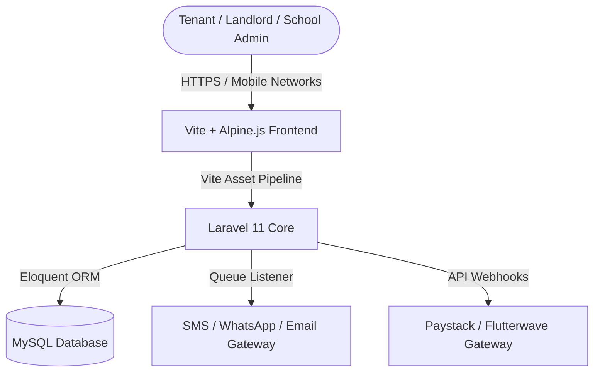

# Hausify (EPM-S) ─ Enterprise Property Management Suite MVP

[](/)
[](https://laravel.com)
[](/)
[](/)

Hausify (**EPM-S**) is a highly-structured, production-ready Enterprise Property Management Suite MVP tailored specifically for the Nigerian and wider Sub-Saharan African real estate markets. Designed to eliminate the operational chaos of fragmented records, manual rent tracking, and scattered receipts, Hausify automates landlord-tenant lifecycles in a high-performance **Technical Grid** layout.

---

## 🎯 Target Segments & Tailored Use Cases

Hausify is engineered to support multiple verticals, adapting its units and billing frameworks to fit local property archetypes:

### 1. Landlords & Residential Estates
*   **Residential & Commercial Complexes**: Manage multi-flat layouts, shops, and office plazas.
*   **Service Charge Administration**: Automate diesel power levies, security fees, and waste disposal bills.
*   **Localized Tenant Onboarding**: Digitally log tenancy application forms, guarantor records, and official KYC (e.g., NIN, BVN validation hints).

### 2. Private & Academic Hostels
*   **Bed Space Allocations**: Model rooms into discrete bed spaces (e.g., Bed A, Bed B) with individual pricing rules.
*   **Hostel Wardens Terminal**: Check-in/check-out students, log security clearance statuses, and track utility histories.
*   **Short-Term / Session Billing**: Support 3-month, 6-month, and academic session leases.

### 3. Schools & Academic Boarding
*   **Boarding House Ledgers**: Track school dormitory allocations integrated directly with terminal school fee invoices.
*   **House Master Console**: Log house reports, track active room occupancies, and manage repair workflows for specific school blocks.

### 4. Property Management & Real Estate Agencies
*   **Multi-Owner Portfolios**: Support agents managing portfolios belonging to multiple external landlords.
*   **Commission & Revenue Splits**: Auto-calculate agency commissions (e.g., 10% standard) and withholding tax (WHT) before routing payouts.
*   **Property Inspector Ticketing**: Let inspection officers generate live inspection checklists and upload photographs of maintenance requirements.

---

## 🚀 Core Production-Ready MVP Features

To thrive in the local Nigerian environment, Hausify implements specialized operational blocks:

*   **💳 Localized Payment Gateways**: Ready-to-go API scaffolding for **Paystack** and **Flutterwave**. Supports:
    *   *NUBAN Bank Transfers* (with automated account generation per invoice).
    *   *USSD payments* (MTN, Airtel, Glo, 9mobile).
    *   *Debit Card processing* (Verve, Mastercard, Visa).
*   **💬 Automated SMS & WhatsApp Reminders**: Integrated queue listeners for **Termii**, **Twilio**, or **Multitexter** APIs. Dispatches automated rent reminders, maintenance ticket status alerts, and payment receipts straight to tenants' phones.
*   **🛜 Low-Bandwidth Optimization**: Lightweight HTML structures, pre-compiled static CSS assets, and minimal JS payload ensure pages load fast on standard mobile networks (2G/3G/4G).
*   **⚖️ Local Regulatory Compliances**: Handles standard calculations for **Withholding Tax (WHT)** on rental income, agency commission percentages, and local tenancy association levies.

---

## 🏗️ Technical Architecture & Stack



*   **Backend**: PHP 8.2+ ─ Laravel 11 Framework (MVC, Eloquent, Queue Jobs).
*   **Frontend**: Vite 7.0+ Pipeline ─ Tailwind CSS v3 (Dynamic Grid System) & Alpine.js (Reactive States).
*   **Database**: MySQL 8.0+ / PostgreSQL 15+.
*   **Caching & Queueing**: Redis / Database Queue driver for robust background SMS queues.

---

## 🗄️ Database Schema Blueprint

The MVP codebase utilizes a highly structured relational database schema:

```
┌──────────────────┐       ┌──────────────────┐       ┌──────────────────┐
│      users       │       │    properties    │       │      units       │
├──────────────────┤       ├──────────────────┤       ├──────────────────┤
│ id (PK)          │◄───── │ id (PK)          │◄───── │ id (PK)          │
│ name, email      │       │ landlord_id (FK) │       │ property_id (FK) │
│ phone, role      │       │ name, address    │       │ name, floor      │
│ bvn_verified_at  │       │ type (Hostel...) │       │ price_per_month  │
└──────────────────┘       └──────────────────┘       └──────────────────┘
                                                                ▲
                                                                │
┌──────────────────┐       ┌──────────────────┐                 │
│     invoices     │       │    tenancies     │                 │
├──────────────────┤       ├──────────────────┤                 │
│ id (PK)          │◄───── │ id (PK)          │                 │
│ tenancy_id (FK)  │       │ tenant_id (FK)   │─────────────────┘
│ amount, due_date │       │ unit_id (FK)     │
│ payment_status   │       │ start_date, end  │
│ tx_ref, channel  │       │ billing_cycle    │
└──────────────────┘       └──────────────────┘
```

---

## 🛠️ Getting Started & Local Installation

Follow these instructions to spin up the Hausify (EPM-S) environment locally:

### 1. Prerequisites
Ensure you have the following installed on your machine:
*   **PHP 8.2+** (with standard extensions: `mbstring`, `xml`, `openssl`, `curl`)
*   **Composer** (PHP Package Manager)
*   **Node.js 18+** & **npm**
*   **MySQL 8.0+** (or MariaDB via XAMPP)

### 2. Setup Environment
```bash
# 1. Clone the repository into your local server directory
cd c:/xampp/htdocs
git clone https://github.com/your-username/epm-s.git myapp
cd myapp

# 2. Install backend dependencies
composer install

# 3. Install frontend dependencies
npm install

# 4. Create your configuration environment file
cp .env.example .env
```

Open `.env` in your text editor and set your local database variables:
```env
DB_CONNECTION=mysql
DB_HOST=127.0.0.1
DB_PORT=3306
DB_DATABASE=hausify_db
DB_USERNAME=root
DB_PASSWORD=

# SMS & Payment gateway credentials placeholder
PAYSTACK_PUBLIC_KEY=pk_live_xxxx
PAYSTACK_SECRET_KEY=sk_live_xxxx
TERMII_API_KEY=t-key-xxxx
```

### 3. Database Initialization & Compiling Assets
```bash
# Generate the application key
php artisan key:generate

# Create the database inside your MySQL server:
# mysql -u root -e "CREATE DATABASE hausify_db;"

# Run the migrations and seed basic roles
php artisan migrate --seed

# Compile Vite frontend assets for production
npm run build
```

### 4. Boot the Server
If using **XAMPP**, boot Apache and MySQL, then head to:
`http://localhost/myapp/public/`

Alternatively, you can run the Laravel CLI server:
```bash
php artisan serve
```
Then navigate to `http://127.0.0.1:8000`.

---

## 🚀 Production Deployment Checklist

To transition this MVP into a public production instance:

1.  **Enforce SSL (HTTPS)**: Ensure all API endpoints and payment webhooks are securely encapsulated.
2.  **Activate Laravel Queue Workers**: Set up a Supervisor script on your server (VPS, AWS, or cPanel) to run the SMS/WhatsApp queue continuously:
    ```bash
    php artisan queue:work --queue=default,notifications --tries=3
    ```
3.  **Setup CRON Scheduler**: Add the Laravel scheduler to your server’s crontab to trigger automatic invoice generation at midnight:
    ```bash
    * * * * * cd /path-to-your-project && php artisan schedule:run >> /dev/null 2>&1
    ```
4.  **Database Backups**: Schedule daily automated SQL backups using packages like `spatie/laravel-backup` to prevent lease record losses.
5.  **CORS & CSRF Integrity**: Ensure your webhook endpoints from Paystack/Flutterwave explicitly verify gateway headers.

---

## 📄 License & Integrity
The Hausify Property Management Suite MVP is open-source software licensed under the [MIT license](LICENSE). Maintained by the core development team for developers building future-proof property software in emerging markets.
